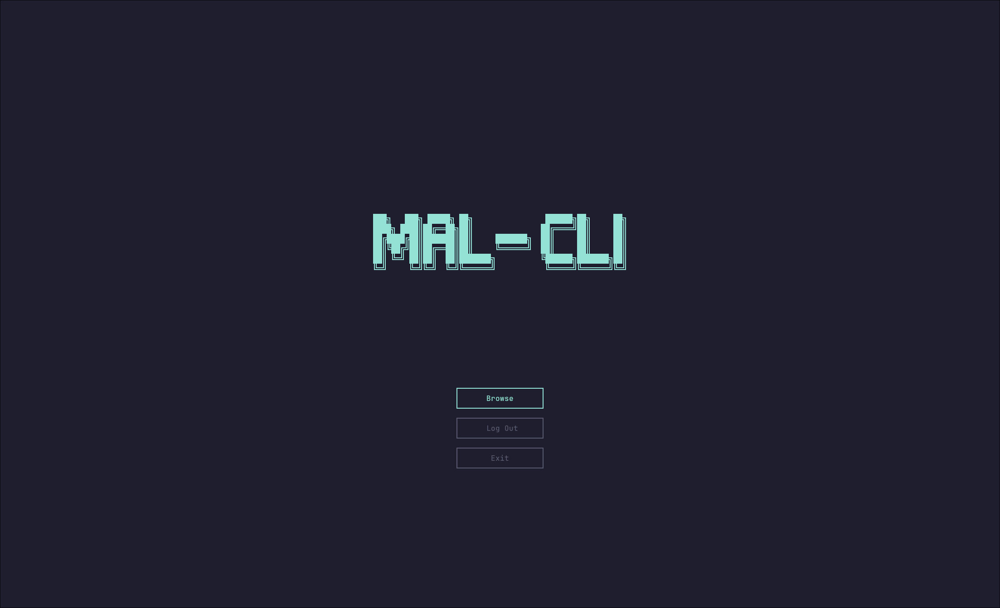
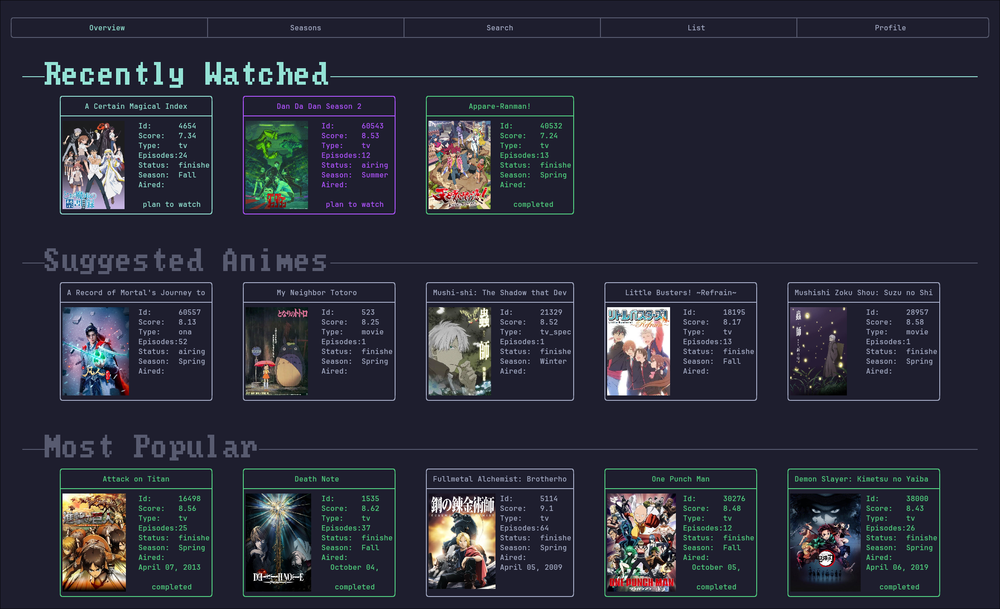
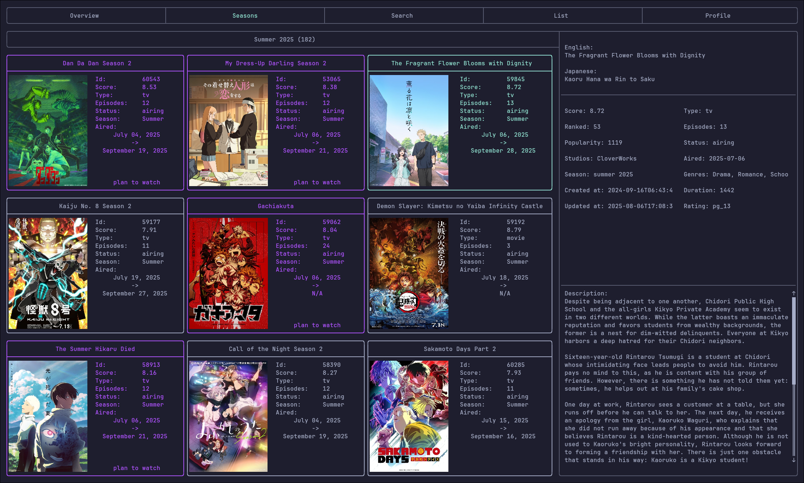
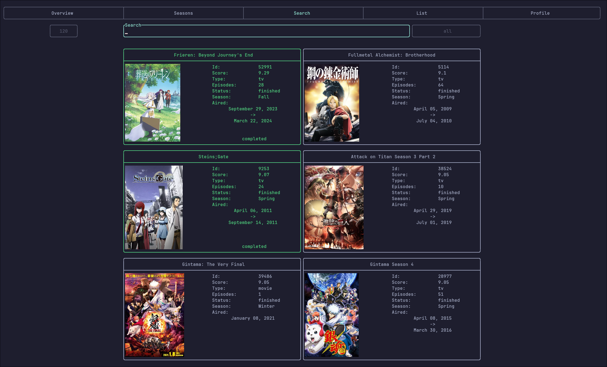
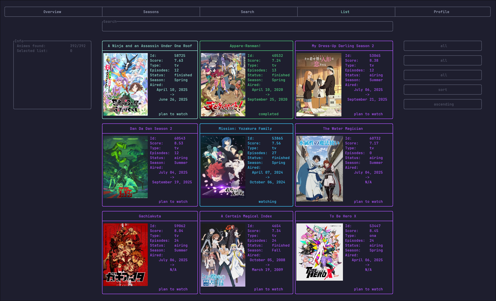
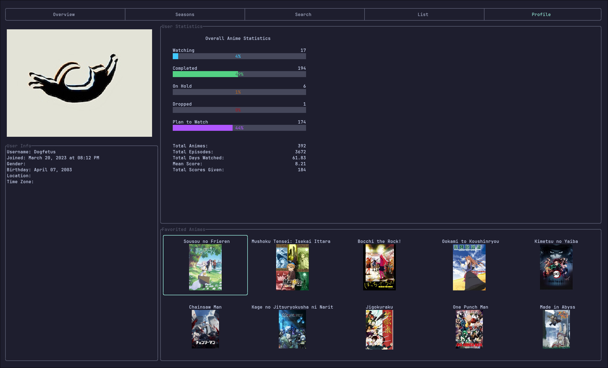

# mal-cli

A Rust-based CLI/TUI for interacting with MyAnimeList integrated with ani-cli for streaming anime episodes.  
Inspired by [ani-cli](https://github.com/pystardust/ani-cli).


# Overview

`mal-cli` allows you to log in with your MyAnimeList account, browse seasonal anime, search titles, view your lists, and play episodes directly in `mpv`, which will automatically update your animelist when you decide to watch something.
It combines **MAL integration** with **ani-cli-style playback** in a single lightweight terminal application.


# Showcase

### Launch


### Overview


### Season List


### Anime Search


### Anime List


### Profile



# Download

<details>
<summary><strong>AUR (Arch)</strong></summary>

```bash
yay -S mal
````

Run with:

```bash
mal
# or
mal-cli
```

</details>

<details>
<summary><strong>Build from Source</strong></summary>

```bash
git clone https://github.com/swstl/mal-cli.git
cd mal-cli
cargo build --release
```

Run with:

```bash
./target/release/mal-cli
```

</details>


# Features

* **User Login** — authenticate with your MAL account
* **Overview** — seasonal highlights at a glance
* **Season List** — browse anime by season
* **Anime Search** — quickly find shows
* **Anime List** — check and update your MAL lists
* **Profile** — view your MAL profile info
* **Episode Playback** — stream anime in `mpv` with automatic list update in MyAnimeList


## Keybindings
Configs are coming soon. 

For now, controls are hardcoded to h, j, k, l ( j and k are flipped compared to normal Vim) or the arrow keys.  
Ctrl + (key) → move to other parts of the same screen  
q → quit popup  
Enter / Space → select items  
Ctrl + c → quit  

## Disclaimer

`mal-cli` is designed to work best in [kitty](https://sw.kovidgoyal.net/kitty/) but should also work in any terminal that supports the **kitty graphics protocol** (for inline images and enhanced rendering).  
Other terminals will work for basic functionality, but screenshots, covers, and some UI features may not display correctly.


# Credits

* [ani-cli](https://github.com/pystardust/ani-cli) - for fetching the episodes
* [jikan](https://github.com/jikan-me/jikan) - for extra info not provided by the regular api

