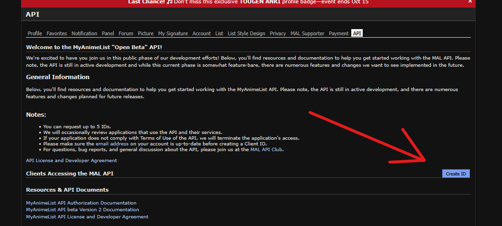
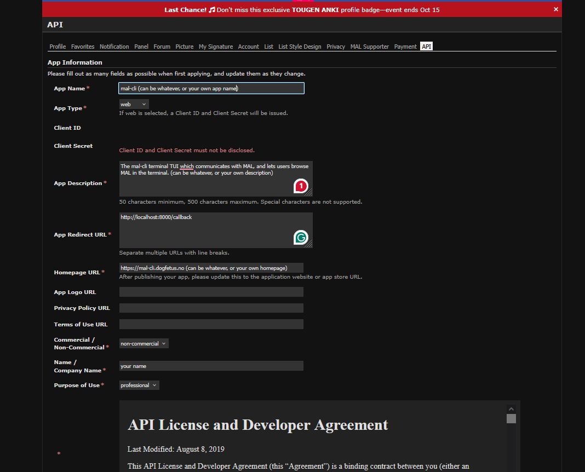
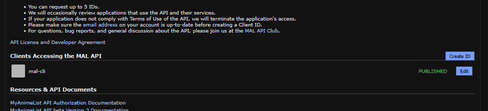
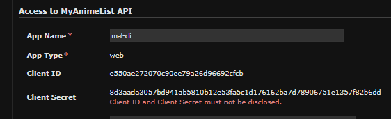

# Server Part

This code runs on a server that handles user authentication and acts as a backend relay for mal-cli, keeping the client secret hidden from the client application.

## Why does this exist?

The server exists so users don't have to create their own MyAnimeList API credentials (Client ID and Client Secret) to use mal-cli. By default, mal-cli connects to my hosted server at `https://mal-cli.dogfetus.no`.

However, if you prefer to host the server yourself (either on your own server or locally), you can follow this guide. Note that you'll need to create your own API credentials on MyAnimeList.

## Self-Hosting Guide

### Step 1: Create MyAnimeList API Credentials

1. Go to https://myanimelist.net/apiconfig

2. Click **"Create ID"** under API Settings:
   

3. Fill in the required information:
   
   
   **Important:** The **App Redirect URL** must match where your server is hosted plus `/callback`
   - Example: `http://localhost:8080/callback`
   - This must match the `MAL_REDIRECT_URL` in Step 2

4. Click **"Submit"** at the bottom of the page. Your app will be published and credentials will be generated:
   

5. Click into your app and note down the **Client ID** and **Client Secret**:
   

### Step 2: Configure Environment Variables

Create a `.env` file in your server directory with your credentials:

```env
MAL_CLIENT_ID=your_client_id_here
MAL_CLIENT_SECRET=your_client_secret_here
MAL_REDIRECT_URL=http://localhost:8080/callback
```

**Note:** Make sure `MAL_REDIRECT_URL` matches the redirect URL you set in Step 1.

### Step 3: Run the Server

**Recommended: Using Docker Compose**

Create a `compose.yaml` file in the same directory as your `.env`:

```yaml
version: "3.9"
services:
  app:
    image: dogfetus/mal-cli:latest 
    env_file:
      - .env
    ports:
      - "8000:8000"
    container_name: mal-cli
    restart: unless-stopped
networks:
  default:
    external: true
    name: public
```

Then run:
```bash
docker compose up -d
```

Verify it's running:
```bash
docker logs mal-cli
```

You should see: `"Now listening on localhost:8000"`

**Alternative: Build from Source**

You can also build and run the server from source if you prefer not to use Docker.

### Step 4: Configure mal-cli Client

Tell mal-cli to use your self-hosted server instead of the default one.

1. Generate and edit the config:
   ```bash
   mal -e
   ```

2. Change this line:
   ```toml
   [network]
   auth_server = "https://mal-cli.dogfetus.no"
   ```

   To:
   ```toml
   [network]
   auth_server = "http://localhost:8000"
   ```
   (Or whatever URL your server is hosted on)

That's it.
